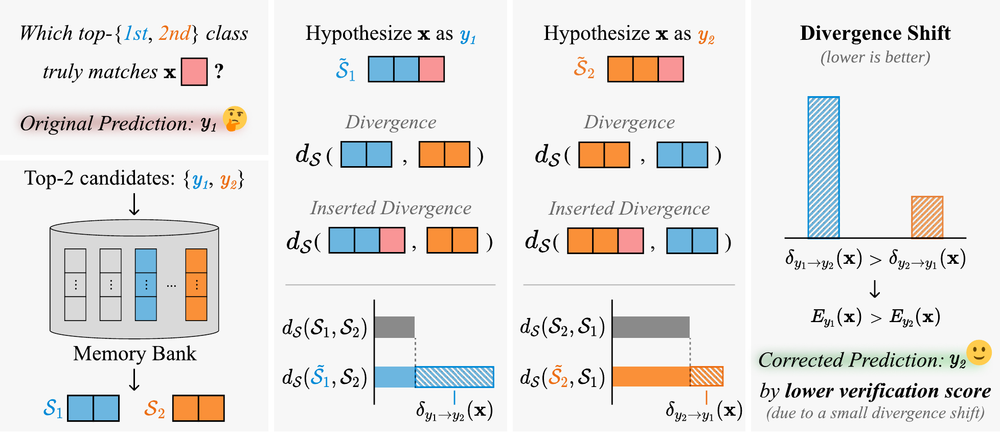

# Efficient Test-time Adaptation through Candidate Verification and Divergence Shifts

**TTC verifies the top-*k* candidates instead of adjusting the prediction.** It inserts the test feature into each candidate's class memory and predicts the class whose subspace shifts least.

<div align="left">

[]()
[]()
[](https://huggingface.co/datasets/SoongE/TTC-features)
[](LICENSE)

</div>

<p align="center">
  
</p>

## Overview
**Test-Time Correction (TTC)** reframes test-time adaptation of vision-language models as candidate verification.
Given a test feature and its top-$k$ candidate labels, TTC treats each candidate as a hypothesis, hypothetically
inserts the feature into the candidate's class memory, and measures the resulting **divergence shift** among the
candidate subspaces. The candidate with the lowest aggregated verification score is selected. TTC is training-free
and requires no gradient updates.

## Setup

```bash
uv sync
source .venv/bin/activate    # or prefix each command below with `uv run`
```

The environment pins PyTorch 2.6.0 + cu124. CLIP weights download to `~/.cache/clip` on first use.

### Repository layout

```
configs/          one YAML per experiment
scripts/          extract.py, run.py, summarize.py
src/ttc/
  config.py       dataclass config, YAML, dotted CLI overrides
  registry.py
  methods/        TTC
  engine/         runs TTC over the test streams of a config
  data/           feature loading, datasets, CoOp splits, CuPL prompts
  clip/           OpenAI CLIP, vendored
```

## Data

TTC runs on pre-extracted features under `./features`, one folder per task. Each file is
`<name>.safetensors` holding a single tensor under the key `<name>`:

```
features
├── zeroshot/<backbone>/<dataset>/            text_weights_cupl  test_f  test_l
├── domain_gen/<backbone>/<dataset>/          text_weights_cupl
│   └── {0aug,10aug}/                         test_f  test_l
├── fewshot/<dataset>/                        test_f  test_l
│   └── <shots>shots/seed<s>/                 text_weights  keys_<shots>shots  values_<shots>shots
├── base2new/<dataset>/{base,new}/            test_f  test_l
│   └── seed<s>/                              text_weights  (base also keys_16shots  values_16shots)
└── cross/<dataset>/                          test_f  test_l
    └── seed<s>/                              text_weights  (imagenet also keys_16shots  values_16shots)
```

`zeroshot` and `domain_gen` hold CLIP RN50 and ViT-B16 features with CuPL text weights. `fewshot`, `base2new` and
`cross` hold features of CoOp-tuned ViT-B/16 prompts; CoOp only tunes the text prompt, so the test features of a
dataset are shared by its shot counts and CoOp seeds. The cross-dataset prompts are the 16-shot ImageNet ones, so
`cross/imagenet` repeats the 16-shot ImageNet run. Each task folder is self-contained.

### Download

The features are on [Hugging Face](https://huggingface.co/datasets/SoongE/TTC-features):

```bash
hf download SoongE/TTC-features --repo-type dataset --local-dir features
hf download SoongE/TTC-features --repo-type dataset --local-dir features --include "cross/*"
```

Each config needs only its own folder: `zeroshot/`, `domain_gen/`, `fewshot/`, `base2new/` or `cross/`; narrow it
further with a pattern such as `--include "zeroshot/ViT-B16/*"`.

### Extracting the CLIP features

The zero-shot and domain-generalization features can also be extracted from the datasets, placed under one root:

```
./data
├── imageNet/val/<wnid>/            only the validation set is used
├── imageNet-A/<wnid>/
├── imageNet-R/<wnid>/
├── imageNet-Sketch/<wnid>/
├── imageNet-V2/<0..999>/           class-index folders
├── caltech101/101_ObjectCategories/
├── dtd/images/
├── eurosat/2750/
├── fgvc-aircraft-2013b/data/images/
├── flowers-102/jpg/
├── food-101/images/
├── oxford-iiit-pet/images/
├── stanford_cars/cars_test/
├── SUN397/
└── UCF-101-midframes/
```

```bash
python -m scripts.extract --backbone ViT-B16 --data-root ./data
python -m scripts.extract --backbone ViT-B16 --data-root ./data \
    --datasets ImageNetA ImageNetR ImageNetSketch ImageNetV2 --aug --views 10
```

This writes `features/zeroshot/<backbone>/<dataset>/` and `features/domain_gen/<backbone>/<dataset>/{0aug,<views>aug}/`
(the ImageNet variants use the ImageNet text embeddings). The split lists and CuPL prompts ship with the package.
The ViT-B/32 and ViT-L/14 features are not hosted; extract them with `--backbone ViT-B32` or `--backbone ViT-L14`.

## Evaluation

```bash
python -m scripts.run --config zeroshot
python -m scripts.run --config domain_generalization
python -m scripts.run --config fewshot
python -m scripts.run --config base_to_novel
python -m scripts.run --config cross_dataset
```

Each run loops over the datasets and seeds of its config, appends one row per test stream to
`outputs/<config>/results.csv`, resumes from the rows already there, and prints the summary table. The zero-shot and
domain-generalization configs use ViT-B16; select another backbone with `--data.backbone` (`RN50`, `ViT-B16`,
`ViT-B32`, `ViT-L14`), whose rows are kept and summarized separately. Any field is overridable inline with a dotted
flag:

```bash
python -m scripts.run --config zeroshot --data.backbone RN50
python -m scripts.run --config domain_generalization --data.aug 0
python -m scripts.run --config zeroshot --data.datasets dtd,eurosat --run.seeds 3407
python -m scripts.summarize outputs
```

<details>
<summary><b>Configs</b></summary>

| config | paper |
| --- | --- |
| `zeroshot` | Table 1 (`--data.backbone RN50` or `ViT-B16`) |
| `domain_generalization` | Table 2, 10-view rows (`--data.aug 0` for the single-view rows; INet from `zeroshot`) |
| `fewshot` | Figure 2 |
| `base_to_novel` | Table 3 |
| `cross_dataset` | Table 4 |
| `zeroshot`, `domain_generalization` with `--data.backbone ViT-B32` or `ViT-L14` | Tables 15, 16 |

</details>

## Citation

```bibtex
@inproceedings{oh2026ttc,
  title     = {Efficient Test-time Adaptation through Candidate Verification and Divergence Shifts},
  author    = {Oh, Seungmin and Kang, Seunghun and Ryu, Jongbin},
  booktitle = {Advances in Neural Information Processing Systems},
  year      = {2026}
}
```

## Acknowledgments

[CLIP](https://github.com/openai/CLIP) (backbone and tokenizer, vendored),
[CoOp](https://github.com/KaiyangZhou/CoOp) (splits and prompt tuning),
and [CuPL](https://github.com/sarahpratt/CuPL) and [APE](https://github.com/yangyangyang127/APE) (CuPL prompts).

## License

[Apache License 2.0](LICENSE). Third-party code and data are listed in [THIRD_PARTY_NOTICES.md](THIRD_PARTY_NOTICES.md).
